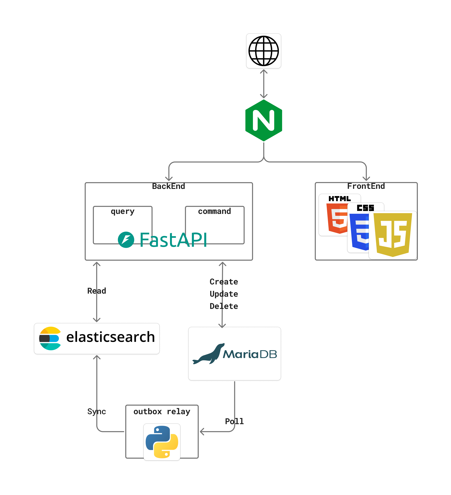

# 📚 도서 검색 서비스

`data/books.csv`(약 3만 건)를 이용한 도서 검색 서비스입니다. CQRS 패턴으로 MariaDB(쓰기)와 Elasticsearch(읽기)를 분리하고, nginx를 단일 진입점으로 사용합니다.

## 1. 🚀 실행 방법

```bash
cp .env.example .env
docker compose up -d --build

# 최초 1회만 (ES 인덱스 생성 → CSV 적재)
docker compose exec query-service python -m app.cli.bootstrap_index
docker compose exec command-service python -m app.cli.load_csv
```

| 항목 | URL |
|---|---|
| 프론트엔드 | http://localhost/ |
| Command API Swagger | http://localhost:8081/docs |
| Query API Swagger | http://localhost:8082/docs |

## 2. 🛠️ 기술스택

| 영역 | 기술 |
|---|---|
| Backend | Python 3.12, FastAPI, SQLAlchemy(async), Alembic |
| 저장소 | MariaDB 11, Elasticsearch 8.15(Nori) |
| 프론트엔드 | HTML / CSS / JS |
| 인프라 | nginx, Docker Compose |

## 3. 🏗️ 구현 범위



**command-service**: 도서 등록·수정·삭제를 맡고, MariaDB에만 접근합니다. 카테고리 존재 여부와 ISBN 중복을 검증해 각각 400/409로 응답하고, 도서 변경과 outbox 이벤트 기록을 같은 트랜잭션으로 묶습니다.

**query-service**: 검색을 맡고, Elasticsearch에만 접근합니다. title/category/author/publisher로 필터링하고, Nori 분석기로 한국어 형태소를 분석해 관련도순으로 정렬합니다. page/size로 페이지네이션하며, 결과가 없어도 200 + 빈 배열로 응답해 파라미터 오류(4xx)와 구분합니다.

**outbox-relay**: MariaDB의 변경을 Elasticsearch로 동기화합니다. `book_outbox`를 500건 배치로 폴링해서 반영하고, 실패하면 재시도하다가 실패가 5회 누적되면 `FAILED`로 저장합니다. CSV 3만 건 적재도 이 경로를 그대로 태워서, 초기 적재 자체가 파이프라인 검증이 되게 했습니다.

**프론트엔드 / nginx**: 프레임워크 없는 순수 JS로 검색부터 등록·수정·삭제까지 한 페이지에서 되게 만들었습니다. nginx는 `location /`에서 정적 파일을 서빙하고, `/api/books`는 메서드 기준으로 command/query에 라우팅해서 전체를 하나의 origin으로 묶습니다.

단위 테스트 21건과 실제 3만 건 데이터로 e2e까지 확인했습니다.

## 4. 🚧 구현하지 못했거나 생략한 부분

**🧪 테스트**

- **자동 통합 테스트**: testcontainers-python으로 MariaDB/Elasticsearch를 매 테스트마다 띄워서 command→outbox→relay→ES 전체 흐름을 검증하려 했지만, 컨테이너 기동 시간과 CI 구성 비용을 고려해 과제 시간 내에 구현할 수 없다고 판단이 되서, 단위 테스트와 실제 인프라 대상 수동 e2e 검증으로 대체했습니다.

**⚡ 안정성**

- **outbox-relay 실패 이벤트 재처리**: 재시도 5회를 넘겨 `FAILED`가 된 이벤트를 Dead Letter Queue로 옮겨 자동 재시도·알림까지 보내려 했지만, 한정된 과제 시간에 따른 구현을 하지 못했습니다.

- **ES 장애 fallback**: CQRS 패턴에서 이중화된 DB를 사용합니다. READ 전용인 Elasticsearch 장애 시 query-service가 일시적으로 MariaDB를 우회해 응답하게 하는 고가용성을 구현하고 싶었지만, 한정된 과제 시간에 따른 구현을 하지 못했습니다.

**🔒 보안**

- **인증/인가**: OAuth2/JWT 기반 인증을 command-service에 붙여 관리자만 도서를 등록·수정·삭제할 수 있게 만들려 했지만, 제가 생각한 이번 과제의 구현 포인트는 검색 기능과 CQRS 패턴이라고 판단해 생략하였습니다.

## 5. 💡 개선하고 싶은 부분

**🔍 기능**

- **검색 고도화**: Elasticsearch의 edge-ngram 분석기로 자동완성을, aggregation으로 카테고리별 집계와 가격/최신순 정렬을 추가하고 싶습니다.

**⚡ 안정성**

- **예외 처리 세분화**: 지금은 처리 안 된 예외가 전부 FastAPI 기본 500 형식으로 뭉뚱그려집니다. DB 연결 오류, ES 타임아웃처럼 원인별로 나눠서 각각 맞는 상태 코드(503 등)와 메시지로 응답하고 싶습니다.

**🧪 테스트**

- **통합 테스트 + CI**: testcontainers과 GitHub Actions를 조합해 PR마다 command → outbox → relay → Elasticsearch 전체 흐름을 실제 컨테이너 환경에서 자동 검증하고 싶습니다.

**📊 운영**

- **관측성**: OpenTelemetry로 command-service → outbox-relay → Elasticsearch까지 요청 하나가 흘러가는 경로를 트레이싱하고, 구조화된 로그를 남겨 Grafana 대시보드에서 outbox 적체량이나 relay 지연을 바로 확인하고 싶습니다.

**🔒 보안**

- **네트워크 격리**: 개발 편의를 위해 MariaDB·Elasticsearch는 물론 command-service/query-service/outbox-relay까지 전부 호스트 포트로 열어놨는데, 이 포트 매핑을 없애서 nginx만 외부에 노출되고 나머지는 도커 내부 네트워크에서만 접근 가능하게 만들고 싶습니다. 실제 배포라면 nginx가 유일한 진입점이라는 전제가 지켜져야 의미가 있는데, 지금은 그 전제가 완전하지 않은 상태입니다.

- **nginx 기반 보안 강화**: HTTPS, `limit_req` 기반 요청 속도 제한, `/metrics` 같은 내부용 엔드포인트에 대한 IP 접근 제한을 추가하고 싶습니다.

**🐳 인프라**

- **Docker 이미지 최적화**: `.dockerignore`가 없어서 빌드 컨텍스트에 `.venv`/`__pycache__` 같은 불필요한 파일까지 전송되고, 컨테이너도 전부 root로 실행됩니다. `.dockerignore` 추가와 non-root 유저 전환으로 빌드 속도와 보안을 같이 개선하고 싶습니다.
